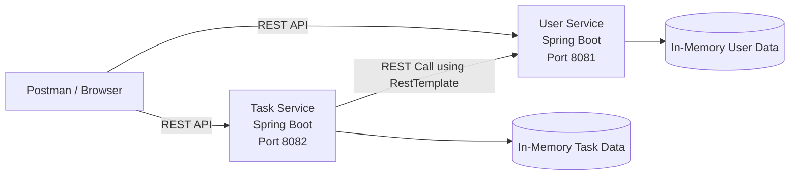

# Week 5 Microservices Architecture Diagram

## Explanation
- User Service manages users.
- Task Service manages tasks.
- Task Service communicates with User Service using REST calls.
- Both services are independent Spring Boot applications.
